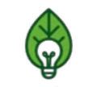

# Verdea - Sustainable Fashion Website

<p align="center">
  
</p>

<p align="center">
  <em>Where Fashion Meets Sustainability</em>
</p>

## About Verdea

**Verdea** is a forward-thinking sustainable fashion company that transforms textile waste into stylish, eco-friendly products. Our name combines *verde* (green) and *idea*, symbolizing our commitment to innovative, environmentally conscious solutions.

### Our Mission
To create smart solutions that reduce carbon footprints, conserve resources, and promote circular economies through upcycled products.

### Our Vision
To become a widely recognized brand for innovative, ethically-made, eco-friendly bags that blend style with purpose.

### What We Do
- **♻️ Upcycled Products**: Transform old clothes into durable, customizable tote bags
- **🌱 92M Tonnes Impact**: Help reduce the 92 million tonnes of textile waste produced yearly
- **🤝 Community Support**: Work with local tailors in Taytay, Rizal, Philippines
- **💚 Sustainable Innovation**: Maximize fabric usage and minimize waste in every product

---

## Website Features

This is a modern, single-page Laravel website showcasing Verdea's sustainable fashion products with:

- 🎨 **Modern Design**: Clean, responsive design with parallax effects and smooth animations
- 📱 **Fully Responsive**: Optimized for desktop, tablet, and mobile devices
- ♿ **Accessible**: Semantic HTML with proper ARIA labels
- 🚀 **Fast Performance**: Optimized assets and efficient loading
- 🎯 **SEO Ready**: Proper meta tags and semantic structure

### Sections
1. **Hero** - Eye-catching introduction with floating product showcase
2. **About** - Company story, mission, and values
3. **Vision & Mission** - Core principles and sustainable practices
4. **Products** - NuVida tote bag collection with customization options
5. **Impact** - Environmental and community impact statistics
6. **CTA** - Call-to-action with customer statistics
7. **Footer** - Company links and social media

---

## Requirements

Before you begin, ensure you have the following installed:

- **PHP** >= 8.2
- **Composer** (PHP dependency manager)
- **Node.js** >= 18.x (optional, for asset compilation)
- **MySQL/PostgreSQL** (optional, if you plan to add database features)

---

## Installation & Setup

### 1. Clone the Repository
```bash
git clone <your-repository-url>
cd verdea
```

### 2. Install PHP Dependencies
```bash
composer install
```

### 3. Environment Configuration
Copy the example environment file and generate application key:
```bash
cp .env.example .env
php artisan key:generate
```

### 4. Configure Environment (Optional)
Edit `.env` file if you need database or other configurations:
```env
APP_NAME=Verdea
APP_URL=http://localhost:8000

# Database configuration (if needed)
DB_CONNECTION=mysql
DB_HOST=127.0.0.1
DB_PORT=3306
DB_DATABASE=verdea
DB_USERNAME=root
DB_PASSWORD=
```

### 5. Storage Permissions
Ensure storage and cache directories are writable:
```bash
# Windows (PowerShell)
# No action needed, Laravel handles this automatically

# Linux/Mac
chmod -R 775 storage bootstrap/cache
```

---

## Running the Application

### Development Server

Start the Laravel development server:
```bash
php artisan serve
```

The website will be available at: **http://127.0.0.1:8000**

### Alternative Port
If port 8000 is busy, specify a different port:
```bash
php artisan serve --port=8080
```

---

## Project Structure

```
verdea/
├── app/                    # Application logic
├── public/                 # Public assets
│   ├── img/               # Images (logo, leaf background)
│   └── site-prototype/    # CSS and JavaScript files
├── resources/
│   └── views/
│       └── site/          # Blade templates
│           └── index.blade.php  # Main single-page website
├── routes/
│   └── web.php            # Web routes
├── extracted_verdea/      # PDF extraction data
└── README.md
```

---

## Key Files

- **`resources/views/site/index.blade.php`** - Main website template
- **`public/site-prototype/styles.css`** - All styling and animations
- **`public/site-prototype/app.js`** - JavaScript for parallax and scroll effects
- **`routes/web.php`** - Route definitions
- **`public/img/`** - Logo and images

---

## Customization

### Updating Content
Edit `resources/views/site/index.blade.php` to modify:
- Text content
- Product descriptions
- Statistics and impact numbers
- Contact information

### Changing Colors
Edit `public/site-prototype/styles.css` and modify CSS variables:
```css
:root {
  --accent: #2f9d63;        /* Primary green */
  --accent-dark: #1d6340;   /* Dark green */
  --accent-light: #4db87d;  /* Light green */
}
```

### Adding Images
Place images in `public/img/` and reference them in Blade templates:
```php

```

---

## Deployment

### Production Checklist
1. Set `APP_ENV=production` in `.env`
2. Set `APP_DEBUG=false` in `.env`
3. Run `php artisan config:cache`
4. Run `php artisan route:cache`
5. Run `php artisan view:cache`
6. Ensure proper file permissions on server

### Recommended Hosting
- **Shared Hosting**: Use Laravel-compatible hosts (e.g., Hostinger, SiteGround)
- **VPS**: DigitalOcean, AWS, or Linode with LAMP/LEMP stack
- **Platform-as-a-Service**: Laravel Forge, Heroku, or Vercel

---

## Browser Support

- ✅ Chrome (latest)
- ✅ Firefox (latest)
- ✅ Safari (latest)
- ✅ Edge (latest)
- ✅ Mobile browsers (iOS Safari, Chrome Mobile)

---

## Credits

- **Framework**: [Laravel](https://laravel.com)
- **Fonts**: [Google Fonts](https://fonts.google.com) (Inter, Montserrat)
- **Images**: [Unsplash](https://unsplash.com)
- **Icons**: Custom SVG icons

---

## License

This project is proprietary software owned by Verdea. All rights reserved.

---

## Contact & Support

- **Email**: info@verdea.com
- **Location**: Taytay, Rizal, Philippines
- **Phone**: +63 123 456 7890

---

<p align="center">
  <strong>Smart Solutions, Sustainable World</strong>
  <br>
  Made with 💚 by Verdea Team
</p>
